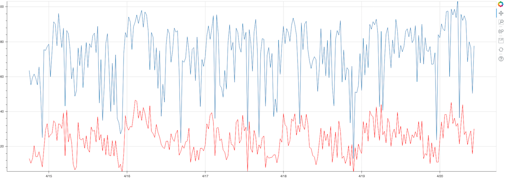

# Speedtest Analysis

_Meant for personal use (my laptop with local data). Other folks might find some useful bits._

This repo analyzes the speedtest results generated from a cronjob that runs a speedtest on the home Monkeybrains internet every 30 minutes.

## Usage
```
npm run generate
```

This copies the `restults.txt` file from the cronjob, parses the file, generates a `bokeh` interactive plot, and serves the generated `html` at `localhost:8080`.



## Conclusion

Lots of awesome for $35/month on a meshnet (@chpwssn).